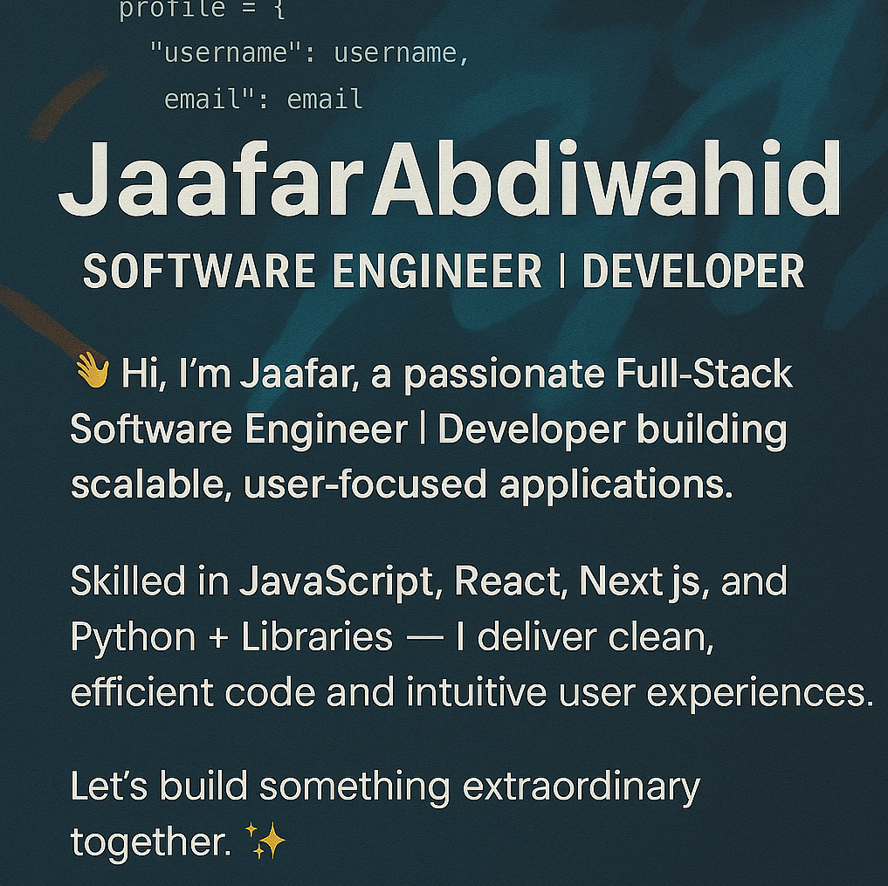

<!DOCTYPE html>
<html lang="en">
<head>
  <meta charset="UTF-8">
  <meta name="viewport" content="width=device-width, initial-scale=1.0">
  <title>Jaafar · Full-Stack Engineer</title>
  <!-- Google Fonts -->
  <link href="https://fonts.googleapis.com/css2?family=Inter:opsz,wght@14..32,300;14..32,400;14..32,500;14..32,600;14..32,700&display=swap" rel="stylesheet">
  <!-- Font Awesome 6 -->
  <link rel="stylesheet" href="https://cdnjs.cloudflare.com/ajax/libs/font-awesome/6.0.0-beta3/css/all.min.css">
  
</head>
<body>

  <!-- Banner Section - your original image preserved -->
  

    
  

  <!-- About Section - clean, no background -->
  

    

      <h1 class="name">Jaafar Abdiwahid</h1>
      
Full-Stack Software Engineer · Creative Developer

      

        
👋 Hi, I'm Jaafar, a passionate Full-Stack Engineer building scalable, user-focused applications with clean code and thoughtful design.

        
Skilled in JavaScript, React, Next.js, and Python ecosystems — I deliver efficient backend systems and intuitive frontend experiences.

        
✨ Let's build something extraordinary together.

      

    

  

  <!-- Social Links -->
  

    

      <a href="https://www.linkedin.com/in/jaafar-abdiwahid/" target="_blank" class="social-link"><i class="fab fa-linkedin-in"></i> LinkedIn</a>
      <a href="mailto:jeyceejeyka635@gmail.com" class="social-link"><i class="fas fa-envelope"></i> Email</a>
      <a href="https://full-stack-portfolio-jade.vercel.app/" target="_blank" class="social-link"><i class="fas fa-globe"></i> Portfolio</a>
      <a href="https://github.com/Jeyceejeyka" target="_blank" class="social-link"><i class="fab fa-github"></i> GitHub</a>
    

  

  <!-- Tech Stack Section - minimal badges -->
  

    <h2 class="section-title">Tech Stack</h2>
    
    

      <h3>Frontend</h3>
      

        <i class="fab fa-react"></i> React
        <i class="fab fa-js"></i> Next.js
        <i class="fas fa-layer-group"></i> Redux
        <i class="fas fa-code-branch"></i> Redux-Saga
        <i class="fab fa-js"></i> JavaScript (ES6+)
        <i class="fas fa-code"></i> jQuery
        <i class="fab fa-html5"></i> HTML5/CSS3
        <i class="fab fa-sass"></i> SASS
        <i class="fab fa-bootstrap"></i> Bootstrap
        <i class="fas fa-wind"></i> TailwindCSS
        <i class="fas fa-chart-line"></i> Chart.js
      

    

    

      <h3>Backend & Databases</h3>
      

        <i class="fas fa-flask"></i> Flask
        <i class="fab fa-python"></i> Python
        <i class="fas fa-database"></i> PostgreSQL
        <i class="fas fa-database"></i> SQLAlchemy
        <i class="fas fa-database"></i> SQLite
        <i class="fas fa-key"></i> JWT
        <i class="fas fa-cloud-upload-alt"></i> REST API
        <i class="fas fa-exchange-alt"></i> Axios
      

    

    

      <h3>DevOps & Tools</h3>
      

        <i class="fab fa-docker"></i> Docker
        <i class="fas fa-sync-alt"></i> CI/CD
        <i class="fab fa-git-alt"></i> Git/GitHub
        <i class="fas fa-flask"></i> Postman
        <i class="fas fa-code"></i> VS Code
      

    

    

      <h3>📚 Upcoming Skills</h3>
      

        <i class="fas fa-brain"></i> Machine Learning
        <i class="fas fa-chart-network"></i> TensorFlow
      

    

  

  <!-- GitHub Analytics - clean, transparent cards -->
  

    <h2 class="section-title">GitHub Analytics</h2>
    

      

        
      

      

        
      

      

        
      

      

        
      

      

        
      

    

    

      

        
      

      

        
      

    

    

      

        
      

      

        
      

    

  

  <!-- Featured Projects -->
  

    <h2 class="section-title">Featured Projects</h2>
    

      

        
<i class="fas fa-shopping-cart"></i>

        
Elysian Market

        
Full-stack e-commerce platform with user auth, cart system, and order tracking.

        React · Flask · PostgreSQL
        
<a href="https://github.com/Jeyceejeyka/project1" class="project-link">View project <i class="fas fa-arrow-right"></i></a>

      

      

        
<i class="fas fa-comments"></i>

        
Chroma Chat

        
Real-time chat application with rooms, typing indicators, and WebSocket connection.

        Next.js · Socket.io · Tailwind
        
<a href="https://github.com/Jeyceejeyka/project2" class="project-link">View project <i class="fas fa-arrow-right"></i></a>

      

      

        
<i class="fas fa-chart-simple"></i>

        
Insightify

        
Interactive data visualization dashboard for analytics and business metrics.

        React · Chart.js · Python
        
<a href="https://github.com/Jeyceejeyka/project3" class="project-link">View project <i class="fas fa-arrow-right"></i></a>

      

    

  

  <!-- Footer with visit counter -->
  

    

      <i class="fas fa-eye"></i>
      
      profile views
    

    
✧ built with clarity & purpose ✧

  

</body>
</html>
